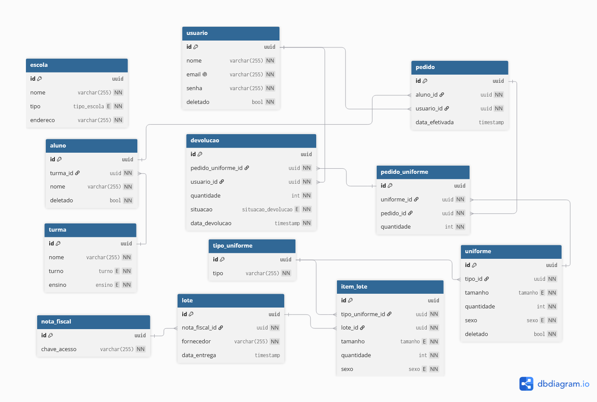

# 6M Uniformes - Backend

Sistema de gestão de uniformes escolares. API REST desenvolvida em Java, responsável por autenticação, gestão de usuários, escolas, turmas, alunos, uniformes, notas fiscais, lotes de entrega e geração de relatórios.

## Sumário

- [Tecnologias](#tecnologias)
- [Como rodar o projeto](#como-rodar-o-projeto)
- [Base URL](#base-url)
- [Banco de dados](#banco-de-dados)
- [Documentação da API (Swagger)](#documentação-da-api-swagger)
- [Autenticação](#autenticação)
- [Formato de erro](#formato-de-erro)
- [Padrões usados no código](#padrões-usados-no-código)
- [Testes](#testes)
- [Rodando o Postgres isoladamente (sem o backend)](#rodando-o-postgres-isoladamente-sem-o-backend)
- [Outros READMEs do projeto](#outros-readmes-do-projeto)

---

## Tecnologias

- **Java 25**
- **Spring Boot** (Web, Data JPA, Security, Validation)
- **PostgreSQL 18**
- **Flyway** (migrações de banco)
- **JWT** (autenticação stateless via `java-jwt`)
- **springdoc-openapi / Swagger** (documentação interativa da API)
- **OpenPDF** (geração de relatórios em PDF)
- **JUnit 5 + Mockito** (testes unitários)
- **Testcontainers** (testes de integração com Postgres real)
- **Docker / Docker Compose**

## Como rodar o projeto

### Pré-requisitos

- Docker instalado
- Arquivo `.env` configurado dentro do backend (veja `.env.example`)

### Subindo o projeto pela primeira vez

```bash
docker compose up -d --build
```

A API estará disponível em `http://localhost:8080`.

### Verificando os logs

```bash
docker compose logs -f backend
docker compose logs -f db
```

### Atualizando o backend após mudanças no código

Sempre que alterar o código-fonte, é preciso rebuildar a imagem do backend:

```bash
docker compose up -d --build backend
```

Se quiser derrubar e recriar tudo do zero (útil se mexeu no `Dockerfile` ou `docker-compose.yml`):

```bash
docker compose down
docker compose up -d --build
```

### Apagando tudo, incluindo os dados do banco

```bash
docker compose down -v
```

⚠️ O comando acima remove o volume `uniform_data` e apaga todos os dados do Postgres.

---

## Base URL

```
http://localhost:8080/api
```

---

## Banco de dados



---

## Documentação da API (Swagger)

Toda a documentação de endpoints — request/response de cada rota, parâmetros, códigos de status — está no Swagger, gerado automaticamente a partir do código:

```
http://localhost:8080/swagger-ui.html
```

Clique em **"Authorize"** no topo da página, cole o token JWT (obtido em `POST /api/auth/login`) e todas as chamadas de teste feitas por ali já enviam o header `Authorization` automaticamente.

Nos endpoints de listagem (paginados), o campo `sort` aceita o formato `campo,direção` (ex: `quantidade,desc`) — clique em "Add string item" para adicionar cada critério de ordenação como um campo separado.

O JSON puro da especificação OpenAPI (útil para gerar clientes ou importar no Postman/Insomnia) fica em:

```
http://localhost:8080/v3/api-docs
```

---

## Autenticação

A API usa **JWT** com sessão stateless. Fluxo básico:

1. `POST /api/auth/login` retorna o token JWT. **`POST /api/usuario/registrar` não retorna token** — ele só cria o usuário; depois de registrar, é preciso chamar `/auth/login` separadamente para autenticar.
2. Envie esse token em toda requisição autenticada, no header:

```
Authorization: Bearer <token>
```

Apenas `POST /api/auth/login` e `POST /api/usuario/registrar` são públicos — todos os demais endpoints exigem o token. O token expira em **10 horas**.

---

## Formato de erro

Toda resposta de erro segue um dos dois formatos abaixo.

**Erro de negócio (`400`/`404`)** — recurso não encontrado ou regra violada (ex: email duplicado, recurso com vínculos que impedem exclusão, parâmetro de ordenação inválido):

```json
{
  "message": "Este email já está em uso"
}
```

**Erro de validação (`400`)** — campos do body que não passaram nas anotações de validação:

```json
{
  "message": "Validation failed",
  "errors": {
    "email": "O formato do email é inválido",
    "senha": "A senha deve ter no mínimo 6 caracteres"
  }
}
```

---

## Padrões usados no código

- IDs são sempre **UUID**, não números incrementais.
- Datas seguem o padrão ISO 8601 (ex: `"2025-06-17T14:30:00"`).
- Em endpoints autenticados, o usuário **nunca** é identificado por um campo no body — sempre pelo token:

```java
@PostMapping
public ResponseEntity<?> criar(@RequestBody PedidoRequestDTO dto,
                                @AuthenticationPrincipal Usuario usuario) {
    // usuario vem do token, não do DTO
    pedidoService.criar(dto, usuario);
}
```

---

## Testes

O projeto tem dois níveis de teste, com propósitos diferentes.

### Testes unitários

Cobrem os `Service` de cada domínio (Usuário, Escola, Turma, Aluno, Uniforme, Lote, Pedido, Relatório, etc.) isoladamente, usando **Mockito** para simular os repositories e services colaboradores. Validam regras de negócio, validações e tratamento de erro sem depender de banco de dados ou rede — por isso rodam rápido e não precisam de nenhuma ferramenta externa.

Rodar só os testes unitários:

```bash
./gradlew test --tests "com.six_m.uniform.domain.*"
```

### Testes de integração (Testcontainers)

Cobrem o fluxo completo da API de ponta a ponta — registrar usuário, logar, criar tipo de uniforme, dar entrada em estoque via lote, criar pedido e confirmar que o estoque foi decrementado corretamente, e gerar relatórios em PDF. Usam **Testcontainers** para subir um **Postgres real em um container Docker**, exclusivo para o teste, com as migrações Flyway aplicadas do zero — garantindo que o comportamento testado é idêntico ao ambiente real (inclusive os enums nativos do Postgres, que um banco em memória não suportaria).

**Pré-requisito:** Docker precisa estar instalado e em execução na máquina que for rodar esses testes.

Rodar o teste de integração:

```bash
./gradlew test --tests FluxoCompletoIntegrationTest
```

Rodar todos os testes (unitários + integração):

```bash
./gradlew test
```

Uma seed de dados de teste (`src/test/resources/db/migration`) roda automaticamente apenas durante os testes, sem afetar o schema de produção — ela não é incluída no `.jar` final da aplicação.

---

## Rodando o Postgres isoladamente (sem o backend)

Útil para debug local:

```bash
docker run -d --name uniform -e POSTGRES_DB=uniform -e POSTGRES_USER=uniform -e POSTGRES_PASSWORD=postgresUniform -p 5432:5432 -v uniform_data:/var/lib/postgresql postgres:18-alpine
```

---

## Outros READMEs do projeto

Este README cobre apenas o **backend**. Continue lendo a documenteção do projeto.

Leia a documentação do projeto: [README](./../README.md)